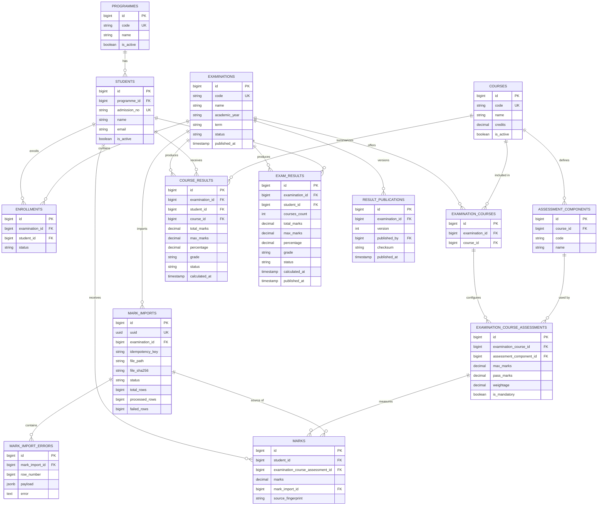

# University Examination & Result Processing System

Production-oriented backend for university examinations, assessment marks, result calculation, publication, and bulk CSV processing.

## Technology Stack

- **Backend:** Laravel 13, PHP 8.3+
- **Database:** PostgreSQL
- **Authentication:** Laravel Sanctum for REST APIs; Laravel session authentication for the Inertia web application
- **Frontend:** Inertia + React 19 + TypeScript + Tailwind CSS
- **Queues / locks / cache:** Redis in production
- **HTTP/API:** REST API under `/api/v1`
- **Async processing:** Laravel queues and batches
- **Testing:** PHPUnit / Laravel feature tests

## Scope and Design Goals

The system is designed for the following operating envelope:

- Up to **1,000,000 students** in the university master data set.
- More than **100,000 students in a single examination**.
- More than **10,000 courses**.
- Multiple examinations being processed concurrently.
- CSV imports containing **100,000+ mark rows**.
- Safe retries, idempotent writes, deterministic result calculation, and controlled result publication.

The main design principle is to keep business rules in application/domain services and keep transport concerns in controllers.

---

# Architecture

The application is split into four logical layers:

```text
                         ┌──────────────────────────┐
                         │        Browser           │
                         │     Inertia + React      │
                         └────────────┬─────────────┘
                                      │ HTTP
                                      ▼
                         ┌──────────────────────────┐
                         │ Laravel Web Controllers  │
                         └────────────┬─────────────┘
                                      │
                         ┌────────────▼─────────────┐
                         │  Application / Domain    │
                         │                          │
                         │ MarkValidationService    │
                         │ ResultCalculator         │
                         │ ResultPublicationService│
                         │ GradingPolicy            │
                         └───────┬─────────┬────────┘
                                 │         │
                     synchronous │         │ asynchronous
                                 │         ▼
                                 │  ┌────────────────────┐
                                 │  │ Redis Queue         │
                                 │  │ imports / results   │
                                 │  └─────────┬──────────┘
                                 │            │
                                 ▼            ▼
                         ┌──────────────────────────┐
                         │ PostgreSQL               │
                         │ OLTP + materialized      │
                         │ result read models       │
                         └──────────────────────────┘

REST clients ──> /api/v1 controllers ──> same domain/services
```

### SOLID / separation of responsibilities

- Controllers validate the request, authorize at the transport boundary, and delegate to application services.
- `MarkValidationService` owns mark-specific business validation.
- `ResultCalculator` owns course and examination result aggregation.
- `ResultPublicationService` owns publication invariants and versioning.
- `GradingPolicy` is an interface, allowing grading rules to change without modifying result orchestration.
- Jobs orchestrate asynchronous work; they do not contain the full business policy.
- Eloquent models represent persistence and relationships rather than the application workflow.

The web UI and REST API intentionally use different controllers but reuse the same domain/application logic.

---

# Examination Lifecycle

The examination state machine is:

```text
draft
  │
  ▼
open
  │
  ▼
processing
  │
  ▼
published
  │
  ▼
archived
```

### Meaning of states

| State | Meaning |
|---|---|
| `draft` | Configuration is being prepared; not ready for calculation/publication. |
| `open` | Enrollment/mark processing is allowed. |
| `processing` | Results are being calculated or finalized. |
| `published` | Results are frozen as a published version for consumers. |
| `archived` | Historical examination retained for audit/reference and removed from active workflows. |

Publication is allowed only from `processing` and only when all active enrollments have a corresponding examination result and no mark import is still queued/processing.

---

# Database Design

The relational design separates master data, examination configuration, raw marks, processing state, and materialized result data.

## Core entities

### Master data

- `programmes`
- `students`
- `courses`
- `assessment_components`

### Examination configuration

- `examinations`
- `examination_courses`
- `examination_course_assessments`
- `enrollments`

### Mark ingestion

- `marks`
- `mark_imports`
- `mark_import_errors`

### Results / publication

- `course_results`
- `exam_results`
- `result_publications`

## Why the schema is normalized

Course and assessment metadata are maintained once, while an examination explicitly decides which courses/components are active and what their rules are for that examination.

`examination_course_assessments` is important because the same course assessment can have different maximum marks, pass marks, weightage, or mandatory rules across examinations.

Raw marks remain separate from calculated results. This makes recalculation possible without losing the source mark record and allows result tables to function as precomputed read models.

## Important constraints

Examples of database-enforced invariants:

```text
students.admission_no UNIQUE
programmes.code UNIQUE
courses.code UNIQUE
examinations.code UNIQUE

(examination_id, student_id) UNIQUE on enrollments
(examination_id, course_id) UNIQUE on examination_courses
(examination_course_id, assessment_component_id) UNIQUE on examination_course_assessments
(student_id, examination_course_assessment_id) UNIQUE on marks
(examination_id, student_id, course_id) UNIQUE on course_results
(examination_id, student_id) UNIQUE on exam_results
(examination_id, idempotency_key) UNIQUE on mark_imports
(mark_import_id, row_number) UNIQUE on mark_import_errors
(examination_id, version) UNIQUE on result_publications
```

These are deliberately implemented at the database level so correctness does not depend only on application code.

---

# ER Diagram

The following Mermaid ER diagram describes the core relational model.



---

# Queue Design

Large imports must never require a single synchronous HTTP request to process 100,000+ rows.

The CSV pipeline is:

```text
Upload CSV
   │
   ▼
MarkImport (queued)
   │
   ▼
PrepareMarksImport
   │
   ├── stream CSV from storage
   ├── validate header
   ├── split into bounded chunks
   │
   ▼
ProcessMarksChunk (1,000 rows)
   │
   ├── bulk lookup students
   ├── bulk lookup examination assessment configuration
   ├── validate each row
   ├── upsert valid marks
   ├── store row-level validation errors
   │
   └── dispatch RecalculateStudentResult
                       │
                       ▼
              calculate course result
              calculate examination result

After import batch completion:

FinalizeMarksImport
   └── completed / failed_validation
```

## Queue separation

Recommended production queues:

```text
imports   -> CSV preparation/chunk processing
results   -> student result calculation
publication/default -> control-plane jobs and lower volume work
```

This prevents a large CSV import from monopolizing workers needed for result calculation.

Redis is the recommended queue backend because it also provides distributed locks and makes queue throughput independently scalable.

For production operations, Laravel Horizon should be used to monitor queue throughput, failures, wait time, and worker health.

---

# Transaction Strategy

Transactions are intentionally scoped to units that need atomicity rather than wrapping the entire import or examination in one huge transaction.

## Mark chunk transaction

Each chunk is processed in memory, then valid marks and validation errors are written in a short database transaction:

```text
BEGIN
  upsert marks
  upsert mark_import_errors
  increment import counters
COMMIT
```

This keeps locks short and avoids holding a transaction open for the duration of a 100,000+ row file.

## Student result transaction

A student's complete result calculation is transactional. The student's active enrollment row is locked before calculating and writing course/examination result records.

This prevents two workers from concurrently publishing contradictory intermediate result state for the same examination/student pair.

## Publication transaction

Publication performs its invariant checks and publication-version creation inside a transaction. The examination is then transitioned to `published`, and result rows receive `published_at`.

Publication is additionally guarded by a distributed cache lock to prevent two application nodes from publishing the same examination concurrently.

## Deadlock handling

Production code should configure bounded transaction retries for transient deadlocks rather than treating the first deadlock as a fatal business failure.

The important principle is **retry the small transaction**, not an entire long-running CSV import.

---

# Idempotency Strategy

Idempotency is implemented at multiple levels.

## Import request idempotency

Each import has an `idempotency_key` and the database enforces:

```text
UNIQUE(examination_id, idempotency_key)
```

A client retrying the same logical upload therefore cannot create a second import record for the same examination/idempotency key.

## Mark idempotency

A logical mark is uniquely identified by:

```text
(student_id, examination_course_assessment_id)
```

The database constraint prevents duplicate logical marks. Processing uses an upsert, making queue retries safe.

## Error row idempotency

Import errors are uniquely identified by:

```text
(mark_import_id, row_number)
```

Retrying the same chunk updates the stored error instead of creating duplicate error rows.

## Source fingerprint

The mark row also stores a SHA-256 `source_fingerprint`. This provides an audit-friendly fingerprint of the logical source mark and can be used in future workflows for change detection.

---

# Concurrency Strategy

The system assumes several workers and multiple application nodes may execute the same logical workflow at the same time.

### Database constraints

Unique constraints are the final protection against duplicate logical state.

### Student result lock

`RecalculateStudentResult` uses Laravel's `WithoutOverlapping` middleware with a key based on:

```text
exam_id + student_id
```

This prevents simultaneous result calculations for the same student/examination from executing concurrently when Redis is configured as the shared lock backend.

### Row-level database lock

The calculator also locks the student's active enrollment row with `FOR UPDATE` within its transaction.

This provides a second layer of concurrency protection at the database level.

### Publication distributed lock

Publication uses a cache lock keyed by examination id:

```text
publish:examination:{id}
```

This is required when more than one Laravel application node is running.

---

# Failure / Retry Strategy

Failures are classified according to whether they are retryable infrastructure/application failures or permanent row-level validation failures.

## Retryable job failures

Jobs are configured with bounded retry counts and timeouts. Typical retry candidates include:

- temporary database contention
- transient Redis/network errors
- storage read failures
- temporary external infrastructure failures

Laravel retries those jobs according to queue configuration.

## Permanent row errors

A malformed CSV row should not cause a 100,000-row file to be discarded.

Examples:

- unknown admission number
- non-numeric marks
- course/component not configured for the examination
- student not enrolled
- marks outside the configured maximum

These are stored in `mark_import_errors`, while valid rows continue processing.

The import is finally marked `completed` when all rows succeed or `failed_validation` when one or more rows have validation errors.

## Poison-job protection

For production, failed jobs should be visible through Horizon and/or a dead-letter/failed-job workflow. Repeatedly failing payloads should not be retried forever.

## Operational rule

A job should be safe to execute again whenever possible. Idempotency and upserts are preferred over trying to guarantee exactly-once execution at the queue infrastructure level.

---

# Result Calculation Strategy

The result model deliberately separates:

1. **Raw marks** – source facts.
2. **Course results** – derived per-course result.
3. **Examination results** – derived per-student examination result.
4. **Publication versions** – immutable-ish published snapshot metadata.

## Current calculation behavior

For each course:

- Sum available component marks.
- Sum configured component maximums.
- Require all assessment components when completeness is required.
- Apply component pass-mark rules for mandatory components.
- Calculate percentage.
- Ask the injected `GradingPolicy` for the grade.

For each student examination result:

- Aggregate configured courses.
- Require all courses to pass for an overall pass.
- Calculate examination percentage.
- Calculate the overall grade using the same policy abstraction.

This is intentionally a simple baseline policy, not a claim that all universities share the same grading rules.

---

# REST API

Base path:

```text
/api/v1
```

Current endpoints include:

| Method | Endpoint | Purpose |
|---|---|---|
| `POST` | `/auth/token` | Issue API token |
| `GET` | `/programmes` | List active programmes |
| `GET` | `/students` | Paginated students |
| `GET` | `/examinations` | List examinations |
| `POST` | `/examinations/{examination}/marks/imports` | Submit marks CSV |
| `GET` | `/imports/{uuid}` | Check import status |
| `POST` | `/examinations/{examination}/calculate` | Queue result calculation |
| `POST` | `/examinations/{examination}/publish` | Publish results |
| `GET` | `/examinations/{examination}/results` | Read published results |

Authentication:

- Browser UI: normal Laravel session authentication.
- REST API: Laravel Sanctum bearer tokens.

---

# Web / Inertia Application

The web layer provides operational screens for:

- dashboard
- examination listing/detail
- student listing
- marks-import submission/status

The Inertia controllers are separate from REST controllers so the web presentation format can evolve independently from the API contract.

React is a presentation layer only; business rules are not placed inside React components.

---

# Scaling Considerations

The initial implementation is deliberately designed so horizontal scaling can be added without changing the domain model.

## Application tier

Laravel can run as multiple stateless application nodes:

```text
                    ┌── Laravel app 1
Load balancer ──────┼── Laravel app 2
                    ├── Laravel app 3
                    └── Laravel app N
```

Shared state must be externalized to PostgreSQL and Redis rather than process memory.

## Queue tier

Workers can scale independently:

```text
imports workers  x N
results workers  x N
```

This is particularly important because CSV imports can create large bursts of CPU/database work.

## Database tier

Recommended production topology:

```text
                         ┌── read replica 1
PostgreSQL primary ──────┼── read replica 2
                         └── backup / standby
```

Writes remain on the primary. Read-heavy published-result queries can be routed to replicas where consistency requirements permit.

## Index strategy

Indexes are placed around the common access paths:

- examination + status
- student + examination enrollment
- examination + course
- examination + student result
- assessment + student marks
- import + row number

Composite indexes should be validated against real query plans as data volume grows rather than assuming every index remains useful forever.

## High-volume tables

The most rapidly growing tables are expected to be:

```text
marks
mark_import_errors
course_results
exam_results
```

For the upper end of the stated scale, PostgreSQL partitioning should be evaluated, especially for `marks` and result-history tables. A natural partitioning candidate is examination id or an examination/academic-year time dimension, depending on query patterns and retention requirements.

Partitioning is intentionally not forced into the starter because it adds operational complexity and should be validated with representative data and query plans first.

## Bulk import at 100k+ rows

The import path avoids:

- one SQL insert per row
- one database transaction for the whole file
- loading the entire file into PHP memory
- calculating the whole examination synchronously in the upload request

For substantially larger files, a future optimization is a PostgreSQL staging table plus `COPY`, followed by set-based validation/upsert. That can outperform row-wise PHP parsing while retaining the same logical data model.

## 1,000,000 students

At this scale:

- never use unbounded `get()` for broad lists
- use pagination/cursor pagination for operational APIs
- avoid `IN (...)` lists that can become excessively large
- process identifiers in bounded chunks
- use covering/targeted indexes for high-frequency lookup paths
- keep result pages read from precomputed tables rather than recomputing on every request

The current result design already follows the last principle.

---

# Technology Choices

## Laravel 13

Chosen for:

- mature ORM and transaction support
- queue primitives
- request validation
- authorization ecosystem
- straightforward REST/API implementation
- good fit for a domain-heavy administrative system

## PostgreSQL

Chosen because the workload needs:

- strong transactional guarantees
- relational integrity
- composite unique constraints
- JSONB for import-error payloads
- row-level locking
- good indexing/query-planning capabilities
- a future path to partitioning and read replicas

## Redis

Chosen for:

- queue transport
- distributed locks
- cache
- scalable worker coordination

## Inertia + React

Chosen so the system can provide a responsive administrative UI while keeping routing and much of the server-side application flow in Laravel.

## REST API

Kept separate from the Inertia transport because future consumers may include:

- mobile applications
- university integrations
- LMS/SIS integrations
- reporting services
- external portals

---

# Trade-offs

## Database-enforced idempotency vs application-only checks

**Choice:** database constraints + application upserts.

**Trade-off:** more database constraints and careful migration design, but correctness survives concurrent requests and worker retries.

## Materialized results vs calculate-on-read

**Choice:** persist `course_results` and `exam_results`.

**Benefit:** published-result reads are cheap and predictable.

**Trade-off:** derived state must be recalculated when marks change, increasing write-side complexity.

For a large university, this is generally preferable because result reads can be extremely frequent after publication.

## Chunked queues vs one giant import job

**Choice:** 1,000-row chunks.

**Benefit:** bounded memory, short transactions, parallelism, retry isolation.

**Trade-off:** more jobs and queue coordination overhead.

## Distributed locks + database locks

**Choice:** both.

**Benefit:** Redis lock prevents overlapping work across application nodes; DB lock protects transaction-level consistency.

**Trade-off:** more moving pieces and an operational dependency on Redis for distributed coordination.

## Simple grading policy vs configurable rules engine

**Choice:** interface-based `GradingPolicy` with a default policy.

**Benefit:** easy to replace without rewriting the calculator.

**Trade-off:** the starter does not yet implement a full university-specific rule engine for CGPA bands, moderation, grace marks, condonation, backlogs, revaluation, or programme-specific grading.

## PostgreSQL partitioning now vs later

**Choice:** design indexes and constraints first; defer mandatory partitioning.

**Benefit:** simpler migrations and local development.

**Trade-off:** the very largest deployment may require a partition migration later.

## PHP CSV parsing vs PostgreSQL COPY

**Choice:** streaming PHP parser for the starter.

**Benefit:** straightforward validation and portability of business logic.

**Trade-off:** PostgreSQL `COPY` + staging tables can provide higher throughput for very large imports, but adds staging design and more set-based SQL.

---

# Assumptions

The following assumptions are intentional:

1. A student belongs to at most one programme at a time in this model.
2. A course has reusable assessment components, while the examination configuration controls the component's marks/pass/weightage behavior.
3. One logical mark exists per student and examination assessment component.
4. Only actively enrolled students are eligible for marks.
5. A missing required assessment makes the course result incomplete/fail under the current baseline policy.
6. Mandatory assessment pass marks participate in the course pass decision.
7. An overall examination pass requires all configured courses to pass under the baseline policy.
8. Result publication is an administrative action and requires all active enrollments to have calculated examination results.
9. CSV files are stored outside the database; object storage is preferred for production.
10. Redis is available as a shared service when the application is horizontally scaled.
11. Published results should be stable and auditable; changes after publication should go through a controlled re-publication/revaluation workflow rather than silently changing old published data.

---

# Intentionally Incomplete Areas

The project deliberately does not claim to be a complete SIS/ERP. The following are extension points rather than hidden requirements:

### Authorization model

A production deployment should add role/policy definitions for examiner, department administrator, controller of examinations, result publisher, and read-only users.

### Advanced academic rules

Not currently implemented as a configurable rules engine:

- CGPA across semesters
- credit-weighted GPA
- moderation
- grace marks
- condonation
- revaluation/rechecking
- supplementary/back-paper attempts
- improvement examinations
- absent/withheld/debarred/incomplete outcomes
- programme-specific pass rules

### Import staging / COPY path

The current implementation is application-driven chunk processing. PostgreSQL `COPY` into a staging table is a future optimization for extreme import throughput.

### Object storage

Production should store large CSVs in S3-compatible/object storage instead of local disk and persist the object key plus checksum.

### Observability

A complete production deployment should add structured logging, metrics, tracing, queue dashboards, import progress telemetry, and alerting.

### Read replicas / partitioning

The schema is designed so these can be introduced, but the starter does not pretend that topology or partition maintenance has already been implemented.

### Full CRUD administration

The starter focuses on the examination/result workflow. Complete master-data administration screens and APIs for programmes, courses, assessment components, enrollments, and academic configuration are intentionally limited.

---

# Testing Strategy

Tests should focus on invariants rather than only controller responses.

Recommended coverage:

## Mark validation

- marks below zero fail
- marks above component maximum fail
- unknown student fails
- inactive/un-enrolled student fails
- course/component not configured for examination fails

## Idempotency

- duplicate import idempotency key does not create a second logical import
- retrying a mark chunk does not duplicate marks
- retrying an error row does not duplicate import errors

## Result calculation

- complete course generates pass/fail correctly
- mandatory component pass mark is enforced
- missing required component makes result incomplete/fail
- examination result aggregates all configured courses

## Concurrency

- overlapping student result jobs do not corrupt result state
- two publication attempts result in one publication transition/version behavior

## Publication guards

- cannot publish a draft/open examination
- cannot publish while mark imports are still processing
- cannot publish when active enrollments are missing examination results
- published results are readable through the published-results API

## Load / performance testing

Representative load tests should be run with:

- 100,000+ mark CSV rows
- 100,000+ active students in one examination
- multiple simultaneous examinations
- multiple result workers
- retry storms / duplicate job delivery

Performance acceptance should be measured from realistic PostgreSQL statistics, not only synthetic PHP benchmarks.

---

# Local Development

A Docker-based development environment can provide:

```text
Laravel app      : http://localhost:8000
PostgreSQL       : localhost:5432
Redis            : localhost:6379
Queue worker     : Redis-backed
```

For a production-like environment, the application should run with PostgreSQL and Redis rather than falling back to SQLite.

---

# Production Topology

A recommended deployment shape is:

```text
                         Internet
                            │
                         Load Balancer
                            │
              ┌─────────────┴─────────────┐
              │                           │
        Laravel App 1               Laravel App N
              │                           │
              └─────────────┬─────────────┘
                            │
                   ┌────────▼────────┐
                   │      Redis      │
                   │ queues/locks    │
                   └───────┬─────────┘
                           │
              ┌────────────▼────────────┐
              │      Queue Workers      │
              │ imports / results       │
              └────────────┬────────────┘
                           │
                   ┌───────▼────────┐
                   │ PostgreSQL     │
                   │ primary        │
                   └───────┬────────┘
                           │
                    read replicas
                           │
                  reporting/read APIs

Large CSVs -> Object Storage
```

---

# Operational Runbook

Useful commands:

```bash
# Build/start

docker compose up -d --build

# Application logs

docker compose logs -f app

# Queue logs

docker compose logs -f queue

# Laravel version

docker compose exec app php artisan --version

# Migration status

docker compose exec app php artisan migrate:status

# Run tests

docker compose exec app php artisan test
```

For production, queue workers should be supervised and monitored rather than run as an unmanaged shell process.

---

# Why This Design

The core trade-off is intentionally **write-side complexity in exchange for predictable correctness and read performance**.

The system assumes that marks and result calculations are operationally expensive but result viewing is frequent and latency-sensitive. Therefore:

- raw marks are normalized and validated once,
- calculations are asynchronous,
- results are materialized,
- publication is controlled and versioned,
- retries are safe,
- concurrency is explicitly handled,
- and the web/API layers remain replaceable without changing the business rules.

That makes the architecture suitable as a foundation for the stated scale while leaving the most deployment-specific optimizations—partitioning, `COPY` imports, replicas, object storage, advanced grading rules, and full observability—to be introduced when real workload measurements justify them.
